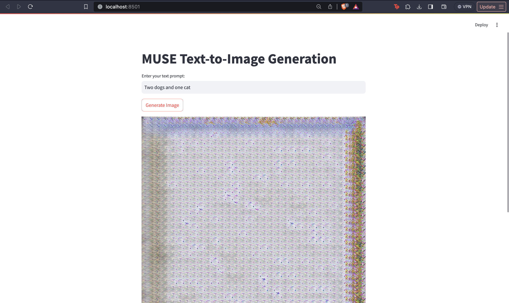
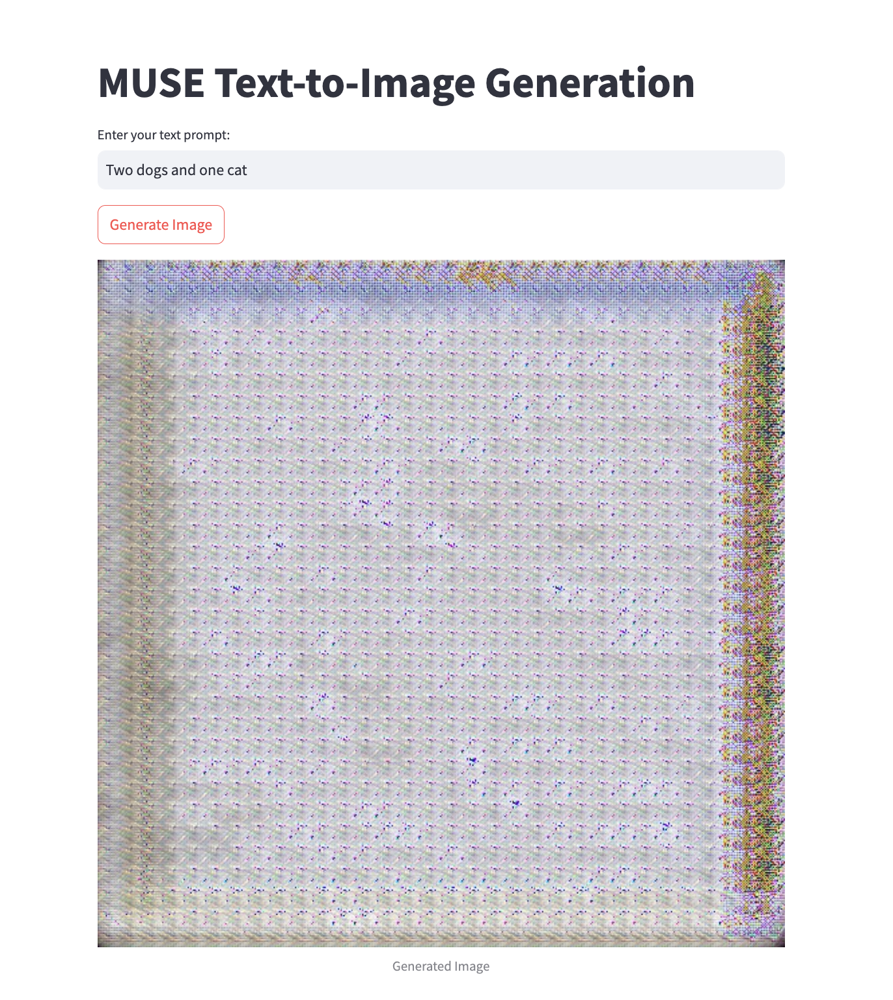

# MUSE PyTorch — Text-to-Image Streamlit App

A [Streamlit](https://streamlit.io/) web app that wraps [lucidrains' `muse-maskgit-pytorch`](https://github.com/lucidrains/muse-maskgit-pytorch) implementation of **MUSE** (Masked Generative Image Transformer) to generate images from text prompts.

Given a text prompt, the app runs it through a base MaskGit transformer and a super-resolution MaskGit transformer (both backed by a shared VQGAN-VAE) to produce a generated image, displayed directly in the browser.




## How it works

- **VQGanVAE** — encodes/decodes images to and from a discrete token codebook (`dim=256`, `codebook_size=65536`).
- **Base MaskGitTransformer + MaskGit** — generates a low-resolution (256×256) token grid conditioned on the text prompt (via a `t5-small` text encoder).
- **Superres MaskGitTransformer + MaskGit** — upsamples the base output to a higher resolution (512×512).
- **Muse** — combines the base and super-resolution `MaskGit` models into a single text-to-image pipeline.

All of this is loaded once via `st.cache_resource` and exposed through a simple Streamlit UI: enter a prompt, click **Generate Image**, and the result is rendered on the page.

## Requirements

- Python 3.9+ (tested with the pinned versions below)
- PyTorch 2.4.1
- Pretrained model checkpoints (VAE, base MaskGit, super-resolution MaskGit) — **not included in this repo**

Key dependencies (see `requirements.txt` for the full pinned list):

```
streamlit==1.38.0
torch==2.4.1
torchvision==0.19.1
muse-maskgit-pytorch==0.3.5
transformers==4.44.2
sentencepiece==0.2.0
pillow==10.4.0
```

## Installation

```bash
git clone https://github.com/notsubash/muse_pytorch.git
cd muse_pytorch
python -m venv venv
source venv/bin/activate  # on Windows: venv\Scripts\activate
pip install -r requirements.txt
```

## ⚠️ Before running

`app.py` currently loads model weights from **hardcoded local absolute paths**:

```python
state_dict = torch.load("/Users/subash/Desktop/Muse_pytorch/models/vae_model.pt", ...)
state_dict = torch.load("/Users/subash/Desktop/Muse_pytorch/models/maskgit_model.pt", ...)
state_dict = torch.load("/Users/subash/Desktop/Muse_pytorch/models/superres_maskgit_model.pt", ...)
```

You'll need to update these three paths to point at your own trained checkpoints:

- `vae_model.pt` — VQGanVAE weights
- `maskgit_model.pt` — base MaskGit transformer weights
- `superres_maskgit_model.pt` — super-resolution MaskGit transformer weights

These checkpoints aren't published in the repo, so you'll need to train your own MUSE models (see `muse-maskgit-pytorch`'s training docs) or otherwise source compatible weights before the app will run.

By default the app runs on CPU (`device = torch.device('cpu')`). If you have a CUDA-capable GPU, change this line in `app.py`:

```python
device = torch.device('cpu')  # change to 'cuda' if a GPU is available
```

## Usage

Once the checkpoint paths are updated:

```bash
streamlit run app.py
```

This opens the app in your browser (default: `http://localhost:8501`). Enter a text prompt and click **Generate Image** to run inference.

## Project structure

```
muse_pytorch/
├── app.py                    # Streamlit app (model loading + UI + inference)
├── requirements.txt          # Pinned Python dependencies
├── Streamlit_output_1.png    # Example app screenshot
├── Streamlit_output_2.png    # Example app screenshot
└── LICENSE                   # MIT License
```

## Limitations

- The example checkpoints used for this project were only trained for **1 epoch**, so generated images are expected to be low quality / undertrained. For better results, train the VAE and MaskGit transformers for significantly longer on your own dataset.

## Reference

- Chang et al., ["Muse: Text-To-Image Generation via Masked Generative Transformers"](https://arxiv.org/abs/2301.00704)
- [lucidrains/muse-maskgit-pytorch](https://github.com/lucidrains/muse-maskgit-pytorch) — the underlying model implementation this app builds on.

## License

MIT © 2024 Subash Pandey — see [LICENSE](LICENSE).
